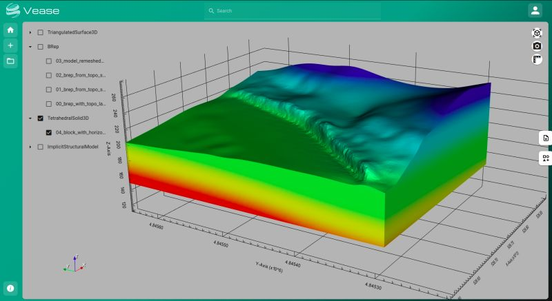

<h1 align="center">Vease<sup><i>by Geode-solutions</i></sup></h1>
<h3 align="center">Open-source geoscience viewer built to ease subsurface data visualization.</h3>

## Installation

Get the [latest](https://github.com/Geode-solutions/Vease/releases/latest) version


#### Windows

Unzip the vease_win32.zip archive and run the app

```powershell
vease.exe
```
Or run the executable version

```powershell
vease_win32.exe
```

#### Linux

Unzip the vease_linux.zip archive and run the app

```shell
./vease
```
Or run the AppImage version

```shell
vease_linux.AppImage --no-sandbox
```
    
## Screenshots




## License

[LGPL-2.1](https://opensource.org/license/lgpl-2-1)

Copyright (c) 2019 - 2025, Geode-solutions

